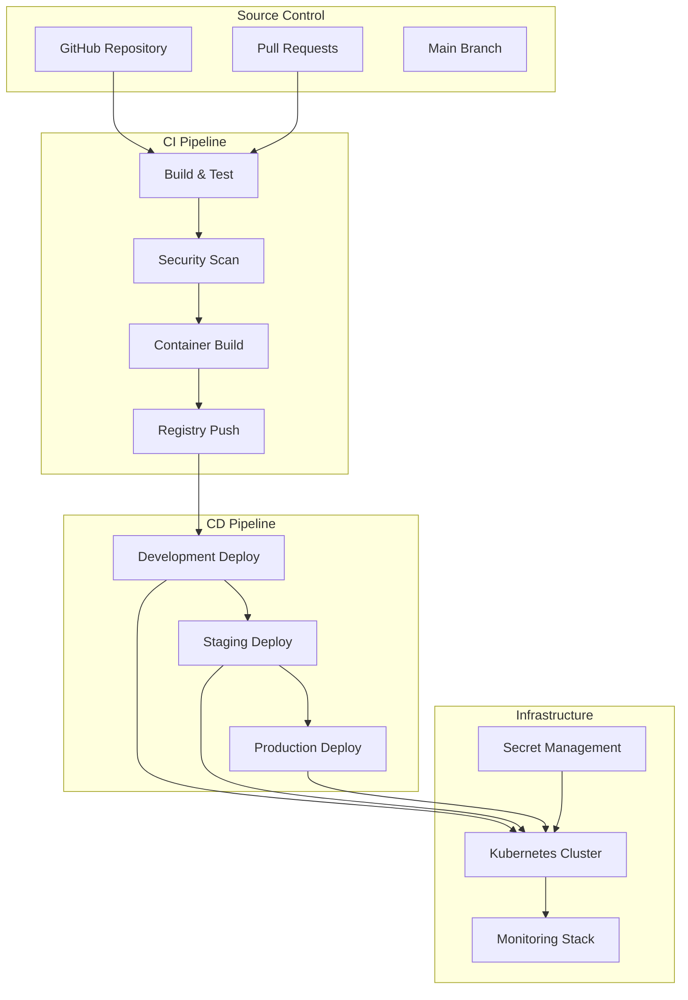
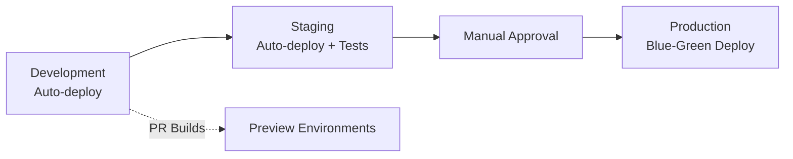
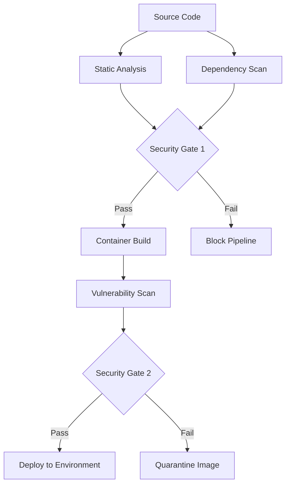
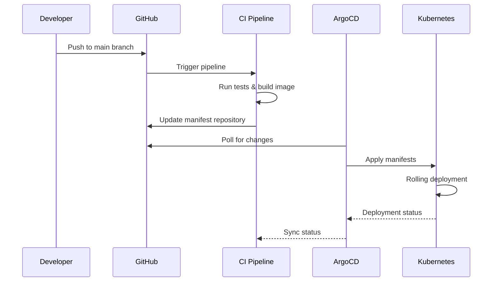

# CI/CD Pipeline Architecture Design
## Context Memory Gateway - Enterprise Deployment Pipeline

### Executive Summary

This document outlines a comprehensive CI/CD pipeline architecture for the Context Memory Gateway, designed to support enterprise-grade deployment with security, reliability, and observability.

## 🏗️ Architecture Overview

### Pipeline Principles
- **GitOps-based**: All deployments driven by Git commits and pull requests
- **Security-first**: Integrated security scanning at every stage
- **Environment promotion**: Automatic progression through dev → staging → production
- **Zero-downtime deployments**: Blue-green and rolling deployment strategies
- **Comprehensive testing**: Multi-layer testing with quality gates
- **Observability**: Full monitoring and alerting throughout the pipeline

### High-Level Architecture



## 🔄 Pipeline Stages

### Stage 1: Source Control Integration
- **Trigger**: Push to feature branches, pull requests, main branch
- **Branch Strategy**: GitFlow with feature → develop → main → release
- **Quality Gates**: Required reviewers, status checks, linear history

### Stage 2: Continuous Integration (CI)

#### 2.1 Code Quality & Testing
```yaml
Quality Gates:
  - Code linting (ruff, black, isort)
  - Type checking (mypy)
  - Security linting (bandit, safety)
  - Unit tests (pytest) - 90% coverage minimum
  - Integration tests - Critical path validation
  - Load tests - Performance regression detection
```

#### 2.2 Security Scanning
```yaml
Security Layers:
  - Static Application Security Testing (SAST)
  - Software Composition Analysis (SCA) 
  - Container vulnerability scanning
  - Infrastructure as Code (IaC) scanning
  - Secrets detection
```

#### 2.3 Container Build & Registry
```yaml
Container Strategy:
  - Multi-stage Dockerfile optimization
  - Distroless base images for security
  - Image signing and verification
  - Harbor/Docker Hub registry with scanning
  - Semantic versioning and tagging
```

### Stage 3: Continuous Deployment (CD)

#### 3.1 Environment Promotion Strategy



#### 3.2 Deployment Strategies
- **Development**: Direct deployment for rapid feedback
- **Staging**: Automated deployment with smoke tests
- **Production**: Blue-green deployment with automatic rollback

### Stage 4: Post-Deployment

#### 4.1 Verification & Monitoring
```yaml
Health Checks:
  - Application health endpoints (/health, /health/ready)
  - Circuit breaker status monitoring  
  - Database connectivity validation
  - External service dependency checks
  - Performance metric validation
```

#### 4.2 Alerting & Rollback
```yaml
Automated Response:
  - Health check failures → Automatic rollback
  - Performance degradation → Alert + Manual review
  - Security alerts → Immediate notification
  - Circuit breaker trips → Escalation protocols
```

## 🛠️ Technology Stack

### CI/CD Platform Options

#### Option A: GitHub Actions (Recommended)
**Pros:**
- Native GitHub integration
- Rich ecosystem of actions
- Cost-effective for open source
- Excellent security features

**Cons:**
- Runner costs for large workloads
- Limited enterprise features vs GitLab

#### Option B: GitLab CI/CD
**Pros:**
- Complete DevOps platform
- Advanced security features
- Built-in container registry
- Excellent Kubernetes integration

**Cons:**
- Migration complexity from GitHub
- Higher costs for enterprise features

#### Option C: Azure DevOps
**Pros:**
- Enterprise-grade features
- Excellent Microsoft integration
- Advanced pipeline capabilities

**Cons:**
- Vendor lock-in
- Learning curve for GitHub users

### Infrastructure Components

```yaml
Container Orchestration:
  Primary: Kubernetes (EKS/GKE/AKS)
  Local Development: Docker Compose
  
Container Registry:
  Options: Harbor, Docker Hub, ECR, ACR, GCR
  Features: Vulnerability scanning, image signing
  
Secret Management:
  Kubernetes: External Secrets Operator
  Cloud: AWS Secrets Manager, Azure Key Vault, GCP Secret Manager
  
Monitoring Stack:
  Metrics: Prometheus + Grafana (Already implemented)
  Logging: ELK/EFK Stack or Cloud Logging
  Tracing: Jaeger/OpenTelemetry (Planned implementation)
  
Infrastructure as Code:
  Terraform: Already implemented
  GitOps: ArgoCD or Flux
```

## 🔐 Security Integration

### Security Scanning Pipeline



### Security Tools Integration
```yaml
SAST Tools:
  - CodeQL (GitHub Advanced Security)
  - SonarQube
  - Bandit (Python-specific)
  
SCA Tools:
  - GitHub Dependabot
  - OWASP Dependency-Check
  - Snyk
  
Container Security:
  - Trivy
  - Clair
  - Aqua Security
  
Infrastructure Security:
  - Checkov (Terraform scanning)
  - TFSec
  - KICS
```

## 🎯 Environment Strategy

### Environment Characteristics

#### Development Environment
```yaml
Purpose: Rapid development and feature testing
Deployment: Automatic on feature branch push
Infrastructure: Lightweight, shared resources
Data: Synthetic/anonymized data
Monitoring: Basic health checks
Access: Development team
```

#### Staging Environment  
```yaml
Purpose: Pre-production validation and integration testing
Deployment: Automatic on main branch merge
Infrastructure: Production-like configuration
Data: Production-like synthetic data
Testing: Full integration and load testing
Access: QA team, stakeholders
```

#### Production Environment
```yaml
Purpose: Live customer traffic
Deployment: Manual approval required
Infrastructure: High availability, auto-scaling
Data: Live customer data with encryption
Monitoring: Comprehensive observability
Access: Operations team, on-call engineers
```

### Preview Environments (Feature Branches)
```yaml
Ephemeral Environments:
  - Created automatically for PR branches
  - Full application stack deployed
  - Accessible via unique URLs
  - Automatically cleaned up after PR merge/close
  - Integration with PR comments for easy access
```

## 🔄 GitOps Integration

### ArgoCD Implementation
```yaml
Repository Structure:
  /manifests/
    /environments/
      /development/
      /staging/  
      /production/
    /base/
      - deployment.yaml
      - service.yaml
      - configmap.yaml
      - secrets.yaml (sealed)
```

### Deployment Synchronization


## 📊 Pipeline Metrics & KPIs

### Development Metrics
```yaml
Velocity Metrics:
  - Deployment frequency (Target: Multiple per day)
  - Lead time (Target: <2 hours)
  - Time to recovery (Target: <30 minutes)
  - Change failure rate (Target: <5%)

Quality Metrics:
  - Test coverage (Target: >90%)
  - Bug escape rate (Target: <2%)
  - Security scan pass rate (Target: 100%)
  - Performance regression rate (Target: <1%)
```

### Operational Metrics
```yaml
Reliability Metrics:
  - Application uptime (Target: 99.9%)
  - Deployment success rate (Target: 98%)
  - Rollback frequency (Target: <5% of deployments)
  - MTTR (Mean Time To Recovery) (Target: <15 minutes)

Security Metrics:
  - Critical vulnerabilities (Target: 0)
  - Security scan coverage (Target: 100%)
  - Secrets leak incidents (Target: 0)
  - Compliance score (Target: 100%)
```

## 🚀 Implementation Phases

### Phase 1: Foundation (Week 1-2)
- [ ] Setup GitHub Actions workflows
- [ ] Implement quality gates (linting, testing)
- [ ] Configure container registry and scanning
- [ ] Setup development environment automation

### Phase 2: Security & Compliance (Week 3-4)
- [ ] Integrate security scanning tools
- [ ] Implement secret management
- [ ] Setup compliance reporting
- [ ] Configure vulnerability management

### Phase 3: Advanced Deployment (Week 5-6)  
- [ ] Implement staging environment
- [ ] Setup blue-green deployment for production
- [ ] Configure monitoring and alerting
- [ ] Implement automated rollback mechanisms

### Phase 4: GitOps & Optimization (Week 7-8)
- [ ] Deploy ArgoCD for GitOps
- [ ] Setup preview environments
- [ ] Implement advanced monitoring
- [ ] Performance optimization and tuning

## 🎛️ Configuration Templates

### Environment Variables per Stage
```yaml
Development:
  ENVIRONMENT: development
  DEBUG: true
  LOG_LEVEL: DEBUG
  RATE_LIMITING: false
  METRICS_ENABLED: true
  
Staging:
  ENVIRONMENT: staging
  DEBUG: false  
  LOG_LEVEL: INFO
  RATE_LIMITING: true
  METRICS_ENABLED: true
  TRACING_ENABLED: true
  
Production:
  ENVIRONMENT: production
  DEBUG: false
  LOG_LEVEL: WARNING
  RATE_LIMITING: true
  METRICS_ENABLED: true
  TRACING_ENABLED: true
  CIRCUIT_BREAKER_STRICT: true
```

### Resource Allocation Strategy
```yaml
Development:
  CPU: 500m
  Memory: 1Gi
  Replicas: 1
  
Staging:
  CPU: 1000m
  Memory: 2Gi  
  Replicas: 2
  
Production:
  CPU: 2000m
  Memory: 4Gi
  Replicas: 3
  Auto-scaling: 3-10 replicas
```

## 🔧 Maintenance & Operations

### Pipeline Maintenance
```yaml
Regular Tasks:
  - Weekly dependency updates
  - Monthly security baseline reviews  
  - Quarterly performance benchmarking
  - Bi-annual disaster recovery testing

Automated Maintenance:
  - Daily security scans
  - Automated dependency updates (Dependabot)
  - Automated certificate rotation
  - Log rotation and cleanup
```

### Monitoring & Alerting
```yaml
Critical Alerts:
  - Pipeline failure rate >5%
  - Deployment success rate <95% 
  - Security scan failures
  - Performance regression >20%
  
Warning Alerts:
  - Test coverage drop >5%
  - Build time increase >50%
  - Resource utilization >80%
  - Dependency vulnerabilities detected
```

## 📋 Checklist for Implementation

### Pre-Implementation
- [ ] Infrastructure prerequisites verified
- [ ] Team training completed
- [ ] Security requirements documented
- [ ] Compliance requirements mapped

### Implementation Verification
- [ ] All quality gates operational
- [ ] Security scanning integrated
- [ ] Rollback procedures tested
- [ ] Monitoring dashboards configured
- [ ] Alert rules validated
- [ ] Documentation updated
- [ ] Team runbooks created

### Post-Implementation
- [ ] Pipeline metrics baseline established
- [ ] Performance benchmarks recorded
- [ ] Security posture verified
- [ ] Disaster recovery procedures tested
- [ ] Team feedback collected and incorporated

---

This CI/CD pipeline architecture is designed to grow with your organization while maintaining security, reliability, and efficiency. The implementation should be phased to ensure proper testing and team adoption at each stage.